# css Grid网格布局
## 概况
网格布局（Grid）是最强大的 CSS 布局方案。
它将网页划分成一个个网格，可以任意组合不同的网格，做出各种各样的布局。以前的布局方法都可以说是一维的布局方式，而Grid最大的特色，是一个基于网格的二维布局。
## 浏览器兼容
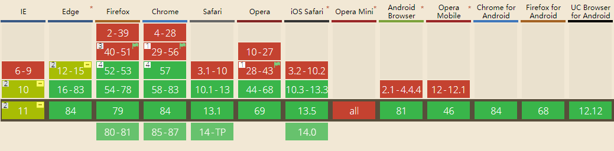
## 基础知识
### 1. 网格容器(container)与子项(item)
采用网格布局(display: grid)的元素，称为"容器"(container)。容器内部采用网格定位的子元素，称为"子项"(item)。
tip:子项只能是容器的顶层子元素，不包含子项的子元素。
### 2. 行(row)与列(column)
容器里面的水平区域称为"行"(row)，垂直区域称为"列"(column)
### 3. 网格线(line)
划分网格的线分界线，称为"网格线"(grid line)。水平网格线划分出行(行网格线)，垂直网格线划分出列(列网格线)。

### 4.单元格(cell)
行和列的交叉区域，称为"单元格"(cell)

### 5. 网格区域(area)
一个 网格区域(Grid Area) 可以由任意数量的网格单元格(Grid Cell) 组成

## 属性目录
在Grid布局中，基于(display:grid | inline-grid),所有相关CSS属性正好分为两类，一类作用在grid容器上，还有一类作用在grid子项上。具体参见下表。
| 作用在grid容器        | 作用在grid子项    |
| --------------------- | ----------------- |
| grid-template-columns | grid-column-start |
| grid-template-rows    | grid-column-end   |
| grid-template-areas   | grid-row-start    |
| grid-template         | grid-row-end      |
| grid-column-gap       | grid-column       |
| grid-row-gap          | grid-row          |
| grid-gap              | grid-area         |
| justify-items         | justify-self      |
| align-items           | align-self        |
| place-items           | place-self        |
| justify-content       |                   |
| align-content         |                   |
| place-content         |                   |
| grid-auto-columns     |                   |
| grid-auto-rows        |                   |
| grid-auto-flow        |                   |
| grid                  |                   |
### 1.作用在grid容器
#### 1.1  grid / inline-grid
将元素定义为网格容器。
grid ：生成一个块级网格；
inline-grid ：生成一个内联网格。
##### 用法举例
`display:grid`
##### tip：
设为网格布局以后，容器子项的float、display: inline-block、display: table-cell、vertical-align和column-*等设置都将失效。
#### 1.2 grid-template-columns | grid-template-rows(行高列宽)
容器指定了网格布局以后，接着就要划分行和列。grid-template-columns：定义每一列的列宽，
grid-template-rows：定义每一行的行高
##### 用法
```
    .container {
        display: grid;
        grid-template-columns: 100px 100px 100px;
        grid-template-rows: 100px 100px 100px;
    }
```
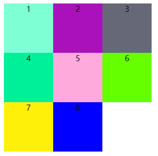
##### 拓展
1. 定义网格单元的宽高，其单位可以是一个长度(如px、em、rem、vw、vh)或百分比，也可以是网格中自由空间的份数(单位为fr)。
2. repeat()
   有时候，重复写同样的值非常麻烦，尤其网格很多时。这时，可以使用repeat()函数, 简化重复的值。上面的代码用repeat()改写如下。
```
    .container {
        display: grid;
        grid-template-columns: repeat(3,100px);
        grid-template-rows: repeat(3,100px);
    }
```

repeat()接受两个参数，第一个参数是重复的次数（上例是3），第二个参数是所要重复的值。
1. auto-fill 关键字
   有时，单元格的大小是固定的，但是容器的大小不确定。如果希望每一行（或每一列）容纳尽可能多的单元格，这时可以使用auto-fill关键字表示自动填充。
```
    .container {
        display: grid;
        grid-template-columns: repeat(auto-fill, 100px);
    }
```

2. fr 关键字
   为了方便表示比例关系，网格布局提供了fr关键字(fraction 的缩写，意为"片段")。如果两列的宽度分别为1fr和2fr，就表示后者是前者的两倍。
```
    .container {
        display: grid;
        grid-template-columns: 1fr 1fr;
        }
```
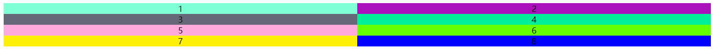 
fr可以与绝对长度的单位结合使用，这时会非常方便。
```
    .container {
        display: grid;
        grid-template-columns: 150px 1fr 2fr;
    }
```
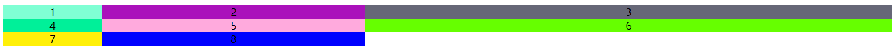
1. minmax()
   minmax()函数产生一个长度范围，表示长度就在这个范围之中。它接受两个参数，分别为最小值和最大值
```
    .container {
        display: grid;
        grid-template-columns: 1fr 1fr minmax(100px, 1fr);
    }
```

1. auto 关键字
   auto关键字表示由浏览器自己决定长度。
```
    .container {
        display: grid;
        grid-template-columns: 100px auto 100px;
    }
```
  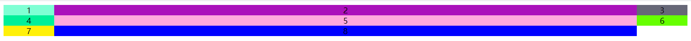
7. 网格线的名称
   grid-template-columns属性和grid-template-rows属性里面，还可以使用方括号，指定每一根网格线的名字，方便以后的引用。
```
    .container {
        display: grid;
        grid-template-columns: [c1] 100px [c2] 100px [c3] auto [c4];
        grid-template-rows: [r1] 100px [r2] 100px [r3] auto [r4];
    }
```
#### 1.3 grid-template-areas(区域)
   网格布局允许指定"区域"(area)，一个区域由单个或多个单元格组成。grid-template-areas属性用于定义区域。
##### 用法
```
    .container {
        display: grid;
        grid-template-columns: 100px 100px 100px;
        grid-template-rows: 100px 100px 100px;
        grid-template-areas: "header header header"
                             "main main sidebar"
                             "footer footer footer";
    }
```
上面代码中，顶部是页眉区域header，底部是页脚区域footer，中间部分则为main和sidebar。如果某些区域不需要利用，则使用"点"（.）表示。
```
    grid-template-areas: 'a . c'
                          'd . f'
                          'g . i';
```
##### 拓展
1. 区域的命名会影响到网格线。每个区域的起始网格线，会自动命名为区域名-start，终止网格线自动命名为区域名-end。
2. grid-template属性是grid-template-columns、grid-template-rows和grid-template-areas这三个属性的合并简写形式。

#### 1.4 grid-column-gap/grid-row-gap/grid-gap(间距)
指定网格线的大小，也可以说是网格子项之间的间距。
grid-row-gap属性设置行与行的间隔(行间距)，grid-column-gap属性设置列与列的间隔(列间距)。
##### 用法
```
    .container {
        display: grid;
        grid-template-columns: 100px 100px 100px;
        grid-template-rows: 100px 100px 100px;
        grid-row-gap: 20px;
        grid-column-gap: 20px;
    }
```
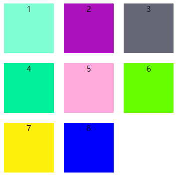
grid-gap属性是grid-column-gap和grid-row-gap的合并简写形式，语法如下：
    `grid-gap: 20px 20px;`
如果grid-gap省略了第二个值，浏览器认为第二个值等于第一个值,简化如下：
    `grid-gap: 20px;`
##### 拓展
根据最新标准，上面三个属性名的grid-前缀已经删除，grid-column-gap和grid-row-gap写成column-gap和row-gap，grid-gap写成gap。
    `gap: 20px;`
#### 1.5 justify-items/align-items/place-items(单元格的水平垂直)
justify-items属性设置单元格内容的水平位置(左中右)，align-items属性设置单元格内容的垂直位置(上中下)。
##### 用法
```
    .container {
        justify-items: start | end | center | stretch;
        align-items: start | end | center | stretch;
    }
```
这两个属性的写法完全相同，都可以取下面这些值。
start：对齐单元格的起始边缘。
end：对齐单元格的结束边缘。
center：单元格内部居中。
stretch：拉伸，占满单元格的整个宽度（默认值）。
##### justify-items
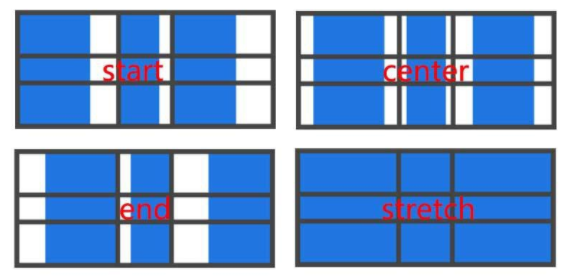
##### align-items
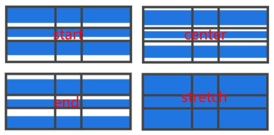
##### 拓展
place-items属性是align-items属性和justify-items属性的合并简写形式。
    `place-items: start end;`
如果省略第二个值，则浏览器认为与第一个值相等。
#### 1.6 justify-content/align-content/place-content(整体内容区域的水平垂直)
justify-content属性是整个内容区域在容器里面的水平位置(左中右)，align-content属性是整个内容区域的垂直位置(上中下)。
##### 用法
```
    .container {
        justify-content: start | end | center | stretch | space-around | space-between | space-evenly;
        align-content: start | end | center | stretch | space-around | space-between | space-evenly;  
    }
```
这两个属性的写法完全相同，都可以取下面这些值。
start:左对齐
end：右对齐
center：居中对齐
stretch：填充网格容器
space-around：在每个网格子项中间放置均等的空间，在始末两端只有一半大小
space-between：两边对齐，在每个网格子项中间放置均等的空间，在始末两端没有空间
space-evenly：网格间隔相等，包括始末两端
##### justify-content
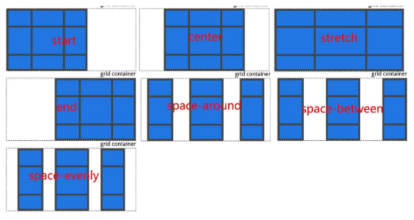
##### align-content
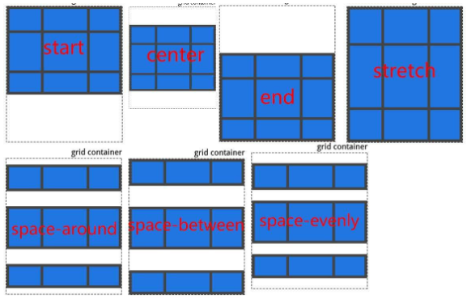
#### 1.7 grid-auto-columns/grid-auto-rows(自动排列)
有时候，一些项目的指定位置，在现有网格的外部。比如网格只有3列，但是某一个项目指定在第5行。这时，浏览器会自动生成多余的网格，以便放置项目。
##### 用法
```
    .container {
        display: grid;
        grid-template-columns: 100px 100px 100px;
        grid-template-rows: 100px 100px 100px;
        grid-auto-rows: 50px; 
    }
```
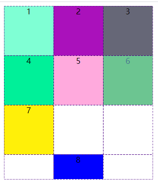
#### 1.8 grid-auto-flow(放置顺序)
划分网格以后，容器的子元素会按照顺序，自动放置在每一个网格。默认的放置顺序是"先行后列"，即先填满第一行，再开始放入第二行
##### 用法
```
    .container{
        display: grid;
        grid-template-columns: 100px 100px 100px;
        grid-template-rows: 100px 100px 100px;
        grid-auto-flow: row; 
    }
```
row：按照行依次从左到右排列

column：按照列依次从上到下排列
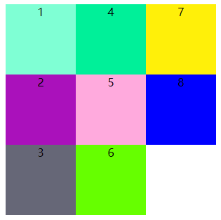
row dense：表示"先行后列"，并且尽可能紧密填满，尽量不出现空格
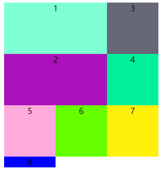
column dense：表示"先列后行"，并且尽可能紧密填满，尽量不出现空格
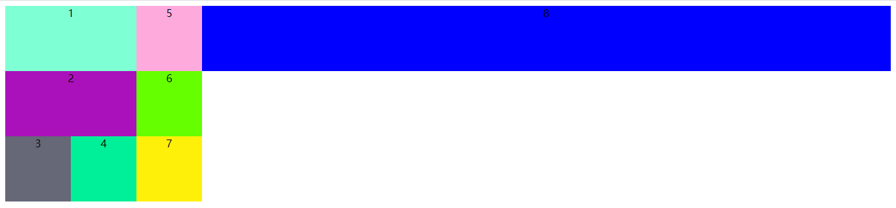

### 2.作用在grid子项
#### 2.1 grid-column-start/grid-column-end/grid-row-start/grid-row-end
项目的位置是可以指定的，具体方法就是指定项目的四个边框，分别定位在哪根网格线。
grid-column-start属性：左边框所在的垂直网格线
grid-column-end属性：右边框所在的垂直网格线
grid-row-start属性：上边框所在的水平网格线
grid-row-end属性：下边框所在的水平网格线
##### 用法
```
    .item-1 {
        grid-column-start: 1;
        grid-column-end: 3;
        grid-row-start: 2;
        grid-row-end: 4;
    }
```
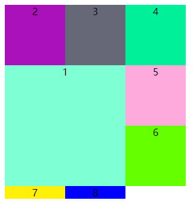
##### 拓展
1. 这四个属性的值，除了指定为第几个网格线，还可以指定为网格线的名字。
```
    .item-1 {
        grid-column-start: header-start;
        grid-column-end: header-end;
    }
```
1. 这四个属性的值还可以使用span关键字，表示"跨越"，即左右边框（上下边框）之间跨越多少个网格。
```
    .item-1 {
        grid-column-start: span 2;
    }
```
#### 2.2 grid-column / grid-row
grid-column属性是grid-column-start和grid-column-end的合并简写形式，grid-row属性是grid-row-start属性和grid-row-end的合并简写形式。
##### 用法
```
    .item-1 {
        grid-column: 1 / 3;
        grid-row: 1 / 2;
    }
    /* 等同于 */
    .item-1 {
        grid-column-start: 1;
        grid-column-end: 3;
        grid-row-start: 1;
        grid-row-end: 2;
    } 
```
上面代码中，项目item-1占据第一行，从第一根列线到第三根列线。
这两个属性之中，也可以使用span关键字，表示跨越多少个网格。
```
    .item-1 {
        background: #b03532;
        grid-column: 1 / 3;
        grid-row: 1 / 3;
    }
    /* 等同于 */
    .item-1 {
        background: #b03532;
        grid-column: 1 / span 2;
        grid-row: 1 / span 2;
    }
```
#### 2.3 grid-area
grid-area属性指定项目放在哪一个区域。
##### 用法
```
    .item-1 {
        grid-area: e;
    } 
```
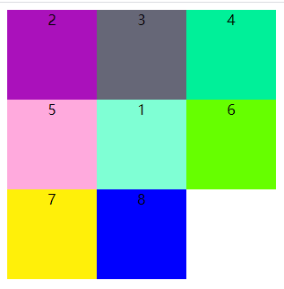
grid-area属性还可用作grid-row-start、grid-column-start、grid-row-end、grid-column-end的合并简写形式，直接指定项目的位置。
```
    .item-1 {
        grid-area: 1 / 1 / 3 / 3;
    }
```
#### 2.4 justify-self/align-self/place-self
justify-self属性设置单元格内容的水平位置(左中右)，跟justify-items属性的用法完全一致，但只作用于单个项目。
align-self属性设置单元格内容的垂直位置(上中下)，跟align-items属性的用法完全一致，也是只作用于单个项目。
##### 用法
```
    .item {
        justify-self: start | end | center | stretch;
        align-self: start | end | center | stretch;
    }
```
这两个属性都可以取下面四个值。 
start：对齐单元格的起始边缘。
end：对齐单元格的结束边缘。
center：单元格内部居中。
stretch：拉伸，占满单元格的整个宽度（默认值）。
##### justify-self
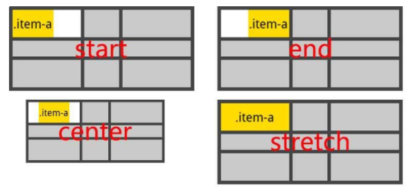
##### align-self
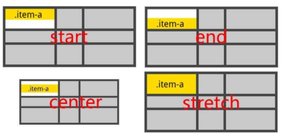
place-self属性是align-self属性和justify-self属性的合并简写形式,如果省略第二个值，place-self属性会认为这两个值相等
#####
```
    place-self: center center;
```
## 参考资料
[CSS Grid 网格布局教程](http://www.ruanyifeng.com/blog/2019/03/grid-layout-tutorial.html)
[CSS：玩转grid布局](https://www.imooc.com/article/43143)