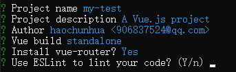
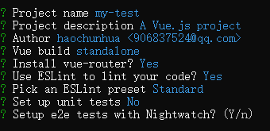

# 前端工程化
前端工程是什么？解决了什么问题？
还记得我在最早期写前端代码时，往往一个页面就是一个文件搞定，HTML/CSS/JS全部写在一起，然后遇到重复的功能就复制粘贴一顿操作。后来知道应该把结构、样式和动作分离，把可以复用的功能与样式封装在一起，将功能进行模块化管理，再后来懂得了可以把UI层面重复的头部、导航、焦点图、侧边栏、底部这些可以抽离出来，封装成组件。这应该就是我接触模块化、组件化的历程。那这样的思想是怎么形成的呢?
### 前端发展史
#### 前后端未分离
早期，前端把页面模板写好，java工程师来将html套成jsp页面，出错率较高，修改问题时需要双方协同开发，效率低下。
前后端职责依旧纠缠不清，在套模板的同时也会出一些粗心引起的问题。

##### 存在的问题
1. 复用性较差。
2. 过于依赖Java运行环境
3. 前后端未分离，耦合性高，职责纠缠不清，代码可读性、维护性差。

####  前后端分离
早期的前后端分离，是通过ajax等技术，使得前端能够独立拿到数据，html+css搭建布局，js的进行DOM操作，使用ajax获取数据实现局部刷新数据，这样的操作反反复复，这种开发模式不仅效率低下、团队分工合作也常出现各种问题(常见的变量污染)、代码复用性低而耦合度高。
现在，随着Vue.js、Angular.js、React.js火起来了。前端自主性增强，也就具备了作为独立一项软件工程的条件，工程化变成了必要。

### 前端工程化
如何做“前端工程化”，我觉得可以通过软件工程思想从模块化、组件化、规范化、自动化这四个方面来考虑。
模块化和组件化能够让我们有序的对项目、功能进行拆分、设计、组织，便于开发、维护和团队的分工，提高工作效率。项目初期规范制定的好坏会直接影响到后期的开发质量，自动化则是将前端工程化的很多脏活累活都应该交给自动化工具来完成
#### 模块化
模块化就是把单独的一个功能封装到一个模块（文件）中，模块之间相互隔离，但是可以通过特定的接口导出内部成员，也可以依赖别的模块，实现文件之间的导入导出，解决复制粘贴造成的代码冗余的问题，实现文件的相互依赖的关系。
##### 模块化的优势
- 提高维护性
- 提高代码复用率
- 方便依赖关系的管理
- 可以避免变量污染，命名冲突

1. js模块化
我们要写一个实现A功能的JS代码，这个功能在项目其他位置也需要用到，那么我们就可以把这个功能看成一个模块采用一定的方式进行模块化编写，既能实现复用还可以分而治之。具体说来，JS模块化方案很多有AMD/CommonJS/UMD/ES6 Module等
2. css模块化
同理在写样式的时候，如果我们需要某种特殊的样式，会在很多地方应用，那么我们也可以采用一定的方式进行CSS的模块化。CSS模块化开发大多是Sass、Less、Stylus、BEM、CSS Modules等。其中预处理器和BEM都会有的一个问题就是样式覆盖。而CSS Modules则是通过JS来管理依赖，最大化的结合了JS模块化和CSS生态，比如Vue中的style scoped。

#### 组件化
组件化是对UI层面的拆分，组件化将页面视为一个容器，页面上各个独立部分视为独立组件，不同的页面根据内容的需要,去盛放相关组件即可组成完整的页面。

components可以单独抽出来形成一个组件库，类似于element-ui这样。

模块化和组件化一个最直接的好处就是复用,同时我们也应该有一个理念,模块化和组件化除了复用之外还有就是分治,我们能够在不影响其他代码的情况下按需修改某一独立的模块或是组件,因此很多地方我们即使没有很强烈的复用需要也可以根据分治需求进行模块化或组件化开发。

#### 规范化
模块化和组件化是工程化思想中具体的开发方式,因此可以简单的认为模块化和组件化是工程化的表现形式，而这些东西的实现就需要规范去落实。规范化其实是工程化中很重要的一个部分，正所谓无规矩不成方圆，一些好的规范则能很好的帮助我们对项目进行良好的开发管理。在我们公司项目中具体表现在一下几个方面：
1.  目录结构，文件命名规范
   
   目录结构的合理设定，能为项目带来很多优点：
      - 有助于提高项目的逻辑结构合理性；
      - 对应扩展和合作；
      - 方便资源的统一定位管理。
2. 编码规范
   对于编码的约束，一般都采用一些强制措施，比如ESLint、StyleLint等，制定一套良好的编码规范可以增强团队开发协作、提高代码质量。
3. 前后端接口规范
4. 文档规范
5. 组件规范
6. Git分支管理
7. Commit描述规范
8. 定期CodeReview
#### 自动化
前端工程化的简单机械的重复劳动都应该让机器去完成。从最早先的 grunt、gulp 等，再到目前的 webpack、parcel，这些自动化工具在自动化合并、构建、打包都能为我们节省很多工作。具体表现为：
1. 图标合并
2. 持续集成
    2.1 自动化构建
    2.2 自动化部署
    2.3 自动化测试

前端工程化是为了提高前端应用质量和开发效率，那工具也很重要，接下来介绍一下我们项目中用到的两个最主要的工具。

### 工具
#### vue-cli
vue-cli脚手架用于快速生成 Vue 项目基础架构。(前提：安装nodejs环境)
1. 全局安装 vue-cli
`npm install --global vue-cli`
2. 创建一个基于 webpack 模板的新项目
`vue init webpack my-project`
   1.项目名称，如果不需要就直接回车。注：此处项目名不能使用大写。
   
   2.项目描述，如果不需要就直接回车。
   
   3.项目作者
   
   4.构建方式(两个选择（上下箭头选择，回车即为选定）建议选择 : Runtime + Compiler:recommended for most users)
   
   5.安装vue的路由插件，需要就选y，否则就n
   
   6.是否使用ESLint检测你的代码？
   
   7.是否安装单元测试(建议n)
   
   8.是否安装E2E测试框架NightWatch(建议n)
   
   9.项目创建后是否要为你运行“npm install”?这里选择包管理工具
   
3. 安装依赖包、组件库
`npm install`
   ——————
4. 启动：
`npm run dev`
   
5. 打包：
`npm run build`
问题一、Vue项目在开发的时候，是处于本地环境，访问服务器数据，由于域名的不一样，所以会出现跨域问题，而axios在跨域访问的时候是有限制的，所以会出现跨域问题
需要在config文件中通过配置代理实现跨域请求

#### webpack
如果我们想将项目部署到服务器上，你放一堆.vue程序，浏览器是无法解析出来的，所以我们需要了解一下打包工具。
webpack 是一个流行的前端项目构建工具（打包工具），更好地自动化处理包括（es6转换，css、js压缩，less、sass的转换等），让我们不再需要手动地去重复做这些事情，解放开发人员的双手，更好地聚焦到业务上的开发
- css预处理器，如less、sass等浏览器不支持
- 部分低版本浏览器不支持es6语法，需要转换为es5语法，为浏览器使用
- 项目依赖过多，文件过多，需要将复杂的代码结构转换为细化
- 模块化打包，保留单个模块的可维护性，又减少了http请求数，优化加载速度
执行
`npm run build`
进行打包，打包成功后，会在项目根目录中生成一个叫dist的文件夹，里面是生成的静态项目：
————
总结起来，前端归根到底也就是html、css、js这三项技术。但在前端的演进过程中，发展出了这些基本技术的衍生品。sass是对css语法的扩展；typescript是js语言的变种。这些衍生物最终还是需要还原成最基本的html，css，js后前端应用才能运行起来。这些都需要一些工具来辅助处理，如bable，postcss等，这些工具是我们构建前端应用必不可少的。而grunt、gulp、webpack则可以帮助我们集成这些工具，方便前端开发调试，并构建出最终可以用于生产环境的高质量应用。
