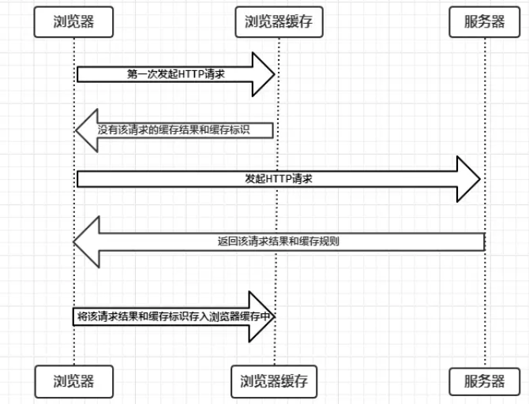
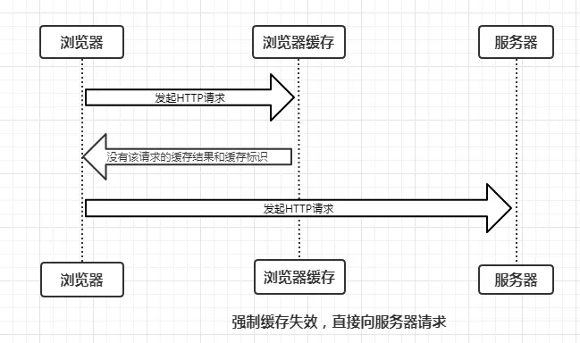
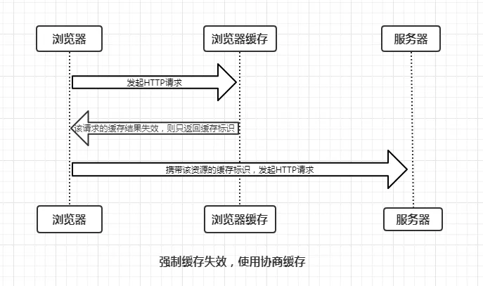
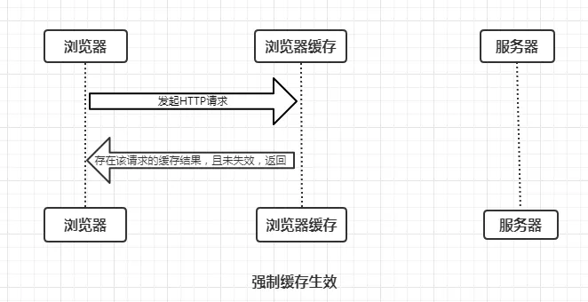
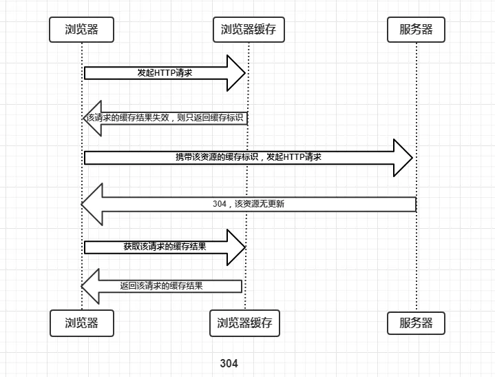
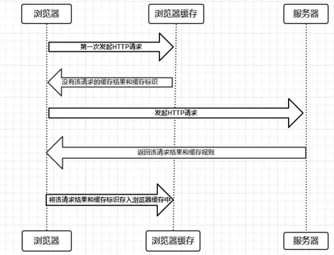
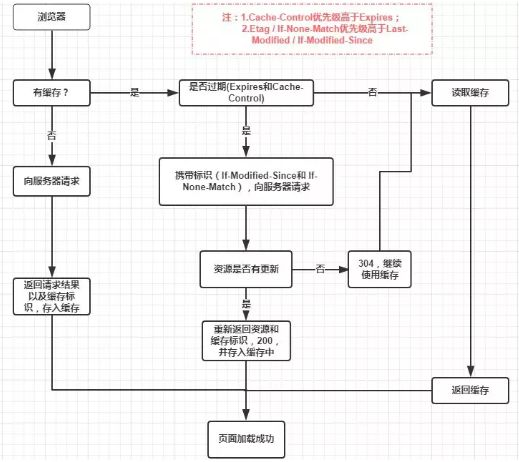

# 浏览器缓存策略

## 问题来源

    状态码304的意义

## 浏览器缓存机制

缓存可以说是性能优化中简单高效的一种优化方式了。一个优秀的缓存策略可以缩短网页请求资源的距离，减少延迟，并且由于缓存文件可以重复利用，还可以减少带宽，降低网络负荷。
对于一个数据请求来说，可以分为发起网络请求、后端处理、浏览器响应三个步骤。浏览器缓存可以帮助我们在第一和第三步骤中优化性能。比如说直接使用缓存而不发起请求，或者发起了请求但后端存储的数据和前端一致，那么就没有必要再将数据回传回来，这样就减少了响应数据。
 在chrome的开发者工具中，在network /Size一列中可以看见一些请求，如果在这列中明确标明大小KB/B，说明这是一个网络请求，否则一般都会明确标明：memory cache,disk cache和ServiceWorker.
 那他们有什么区别呢？

### 缓存位置

浏览器可以在内存、硬盘中开辟一个空间用以保存请求资源的副本。我们经常在 Dev Tools 里面看到 Memory Cache（内存缓存）和 Disk Cache（硬盘缓存），指的就是缓存所在的位置。请求一个资源时，会按照优先级（Service Worker -> Memory Cache -> Disk Cache -> Push Cache）依次查找缓存，如果命中则使用缓存，否则发起网络请求。

#### 1.Service Worker

Service Worker 是运行在浏览器背后的独立线程，一般可以用来实现缓存功能。使用 Service Worker的话，传输协议必须为 HTTPS。因为 Service Worker 中涉及到请求拦截，所以必须使用 HTTPS 协议来保障安全。Service Worker 的缓存与浏览器其他内建的缓存机制不同，它可以让我们自由控制缓存哪些文件、如何匹配缓存、如何读取缓存，并且缓存是持续性的。
Service Worker 实现缓存功能一般分为三个步骤：首先需要先注册 Service Worker，然后监听到 install 事件以后就可以缓存需要的文件，那么在下次用户访问的时候就可以通过拦截请求的方式查询是否存在缓存，存在缓存的话就可以直接读取缓存文件，否则就去请求数据。
当 Service Worker 没有命中缓存的时候，我们需要去调用 fetch 函数获取数据。也就是说，如果我们没有在 Service Worker 命中缓存的话，会根据缓存查找优先级去查找数据。但是不管我们是从 Memory Cache 中还是从网络请求中获取的数据，浏览器都会显示我们是从 Service Worker 中获取的内容。

#### 2.memory cache

当我们访问过页面以后，再次刷新页面，可以发现很多数据都来自于内存缓存。表示不访问服务器，直接从内存中读取缓存。主要包含的是当前中页面中已经抓取到的资源,例如页面上已经下载的样式、脚本、图片等。读取内存中的数据肯定比磁盘快,内存缓存虽然读取高效，可是缓存持续性很短，会随着进程的释放而释放。 一旦我们关闭 Tab 页面，内存中的缓存也就被释放了。一般来说，系统不会给内存分配较大的容量，因此内存缓存一般用于存储较小文件。同时内存缓存在有时效性要求的场景下也很有用（比如浏览器的隐私模式）。

#### 3.disk cache

表示不访问服务器，直接从硬盘中读取缓存。与内存相比，硬盘的读取速度相对较慢，但硬盘缓存持续的时间更长，关闭进程之后，缓存的资源仍然存在。由于硬盘的容量较大，因此一般用于存储大文件。

#### 4.Push Cache

Push Cache（推送缓存）是 HTTP/2 中的内容，当以上三种缓存都没有命中时，它才会被使用。它只在会话（Session）中存在，一旦会话结束就被释放，并且缓存时间也很短暂，在Chrome浏览器中只有5分钟左右，同时它也并非严格执行HTTP头中的缓存指令。
Push Cache 在国内能够查到的资料很少，也是因为 HTTP/2 在国内不够普及。这里推荐阅读 JakeArchibald的 HTTP/2 push is tougher than I thought 这篇文章，文章中的几个结论：

+ 1.所有的资源都能被推送，并且能够被缓存,但是 Edge 和 Safari 浏览器支持相对比较差
+ 2.可以推送 no-cache 和 no-store 的资源
+ 3.一旦连接被关闭，Push Cache 就被释放
+ 4.多个页面可以使用同一个HTTP/2的连接，也就可以使用同一个Push Cache。这主要还是依赖浏览器的实现而定，出于对性能的考虑，有的浏览器会对相同域名但不同的tab标签使用同一个HTTP连接。
+ 5.Push Cache 中的缓存只能被使用一次
+ 6.浏览器可以拒绝接受已经存在的资源推送
+ 7.你可以给其他域名推送资源
  
如果以上四种缓存都没有命中的话，那么只能发起请求来获取资源了。

### 缓存过程分析

浏览器与服务器通信的方式为应答模式，即是：浏览器发起HTTP请求 – 服务器响应该请求，那么浏览器怎么确定一个资源该不该缓存，如何去缓存呢？浏览器第一次向服务器发起该请求后拿到请求结果后，将请求结果和缓存标识存入浏览器缓存，浏览器对于缓存的处理是根据第一次请求资源时返回的响应头来确定的。具体过程如下图：

### 缓存类型

那么为了性能上的考虑，大部分的接口都应该选择好缓存策略，通常浏览器缓存策略分为两种：强缓存和协商缓存，并且缓存策略都是通过设置 HTTP Header 来实现的。

#### 强缓存

不会向服务器发送请求，直接从缓存中读取资源，在chrome控制台的network选项中可以看到该请求返回200的状态码，并且size显示from disk cache或from memory cache.强制缓存的情况主要有三种(暂不分析协商缓存过程)，如下：
不存在该缓存结果和缓存标识，强制缓存失效，则直接向服务器发起请求（跟第一次发起请求一致），如下图：

存在该缓存结果和缓存标识，但该结果已失效，强制缓存失效，则使用协商缓存(暂不分析)，如下图:

存在该缓存结果和缓存标识，且该结果尚未失效，强制缓存生效，直接返回该结果，如下图:

当浏览器向服务器发起请求时，服务器会将缓存规则放入HTTP响应报文的HTTP头中和请求结果一起返回给浏览器，控制强制缓存的字段分别是Expires和Cache-Control，其中Cache-Control优先级比Expires高。

##### 强缓存有关的header

###### Expires

缓存过期时间，用来指定资源到期的时间，是服务器端的具体的时间点。也就是说，Expires=max-age + 请求时间，需要和Last-modified结合使用。Expires是Web服务器响应消息头字段，在响应http请求时告诉浏览器在过期时间前浏览器可以直接从浏览器缓存取数据，而无需再次请求。
Expires 是 HTTP/1 的产物，受限于本地时间，如果修改了本地时间，可能会造成缓存失效。

###### Cache-Control

在HTTP/1.1中，Cache-Control是最重要的规则，主要用于控制网页缓存。比如当 Cache-Control:max-age=300时，则代表在这个请求正确返回时间（浏览器也会记录下来）的5分钟内再次加载资源，就会命中强缓存。
Cache-Control 可以在请求头或者响应头中设置，并且可以组合使用多种指令：
下面列举一些 Cache-control 字段常用的值：(完整的列表可以查看 [MDN](https://developer.mozilla.org/zh-CN/docs/Web/HTTP/Headers/Cache-Control))

+ public：所有的内容都可以被缓存 (包括客户端和代理服务器， 如 CDN)
+ private：所有的内容只有客户端才可以缓存，代理服务器不能缓存。默认值。
+ max-age：即最大有效时间，在上面的例子中我们可以看到
+ must-revalidate：如果超过了 max-age 的时间，浏览器必须向服务器发送请求，验证资源是否还有效。
+ no-cache：虽然字面意思是“不要缓存”，但实际上还是要求客户端缓存内容的，只是是否使用这个内容由后续的对比来决定。
+ no-store: 真正意义上的“不要缓存”。所有内容都不走缓存，包括强制和对比。

#### 协商缓存

协商缓存就是强制缓存失效后，浏览器携带缓存标识向服务器发起请求，由服务器根据缓存标识决定是否使用缓存的过程，主要有以下两种情况：
协商缓存生效，返回304，如下:

协商缓存失效，返回200和请求结果结果，如下

同样，协商缓存的标识也是在响应报文的HTTP头中和请求结果一起返回给浏览器的，控制协商缓存的字段分别有：Last-Modified / If-Modified-Since和Etag / If-None-Match，其中Etag / If-None-Match的优先级比Last-Modified / If-Modified-Since高。

##### 协商缓存有关的header

###### Last-Modified / If-Modified-Since

Last-Modified是服务器响应请求时，返回该资源文件在服务器最后被修改的时间
If-Modified-Since则是客户端再次发起该请求时，携带上次请求返回的Last-Modified值，通过此字段值告诉服务器该资源上次请求返回的最后被修改时间。
服务器收到该请求，发现请求头含有If-Modified-Since字段，则会根据If-Modified-Since的字段值与该资源在服务器的最后被修改时间做对比，
若服务器的资源最后被修改时间大于If-Modified-Since的字段值，则重新返回资源，状态码为200；
否则则返回304，代表资源无更新，可继续使用缓存文件.

但是他还是有一定缺陷的：

+ 如果资源更新的速度是秒以下单位，那么该缓存是不能被使用的，因为它的时间单位最低是秒。
+ 如果文件是通过服务器动态生成的，那么该方法的更新时间永远是生成的时间，尽管文件可能没有变化，所以起不到缓存的作用

###### Etag / If-None-Match

为了解决上述问题，出现了一组新的字段 Etag 和 If-None-Match
Etag是服务器响应请求时，返回当前资源文件的一个唯一标识(由服务器生成)
f-None-Match是客户端再次发起该请求时，携带上次请求返回的唯一标识Etag值，通过此字段值告诉服务器该资源上次请求返回的唯一标识值。
服务器收到该请求后，发现该请求头中含有If-None-Match，则会根据If-None-Match的字段值与该资源在服务器的Etag值做对比，一致则返回304，代表资源无更新，继续使用缓存文件；
不一致则重新返回资源文件，状态码为200.

两者的共同点是，都是从客户端缓存中读取资源；区别是强缓存不会发请求，协商缓存会发请求。

### 缓存机制

强制缓存优先于协商缓存进行，若强制缓存(Expires和Cache-Control)生效则直接使用缓存，若不生效则进行协商缓存(Last-Modified / If-Modified-Since和Etag / If-None-Match)，协商缓存由服务器决定是否使用缓存，若协商缓存失效，那么代表该请求的缓存失效，返回200，重新返回资源和缓存标识，再存入浏览器缓存中；生效则返回304，继续使用缓存。具体流程图如下：

### 实际场景应用缓存策略

#### 1.频繁变动的资源

`Cache-Control: no-cache`
对于频繁变动的资源，首先需要使用 Cache-Control:no-cache 使浏览器每次都请求服务器，然后配合 ETag 或者 Last-Modified 来验证资源是否有效。这样的做法虽然不能节省请求数量，但是能显著减少响应数据大小。

#### 2.不常变化的资源

`Cache-Control: max-age=31536000`
通常在处理这类资源时，给它们的 Cache-Control 配置一个很大的 max-age=31536000 (一年)，这样浏览器之后请求相同的 URL 会命中强制缓存。而为了解决更新的问题，就需要在文件名(或者路径)中添加 hash， 版本号等动态字符，之后更改动态字符，从而达到更改引用 URL 的目的，让之前的强制缓存失效 (其实并未立即失效，只是不再使用了而已)。

### 用户行为对浏览器缓存的影响

所谓用户行为对浏览器缓存的影响，指的就是用户在浏览器如何操作时，会触发怎样的缓存策略。主要有 3 种：

打开网页，地址栏输入地址： 查找 disk cache 中是否有匹配。如有则使用；如没有则发送网络请求。
普通刷新 (F5)：因为 TAB 并没有关闭，因此 memory cache 是可用的，会被优先使用(如果匹配的话)。其次才是 disk cache。
强制刷新 (Ctrl + F5)：浏览器不使用缓存，因此发送的请求头部均带有 Cache-control: no-cache(为了兼容，还带了 Pragma: no-cache),服务器直接返回 200 和最新内容。